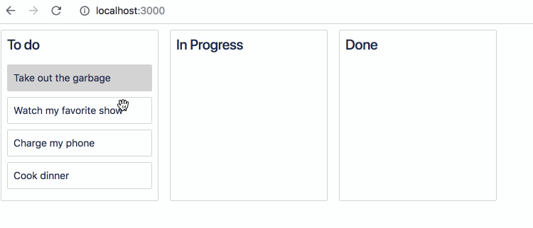

# React Beautiful Dnd Note

- [Beautiful and Accessible Drag and Drop with react-beautiful-dnd](https://egghead.io/courses/beautiful-and-accessible-drag-and-drop-with-react-beautiful-dnd)

Demo:

一开始以为这个视频教程是讲解如何使用原生的 HTML5 Drag and Drop API 来实现这个示例的，仔细一看才发现其实只是展示 [react-beautiful-dnd](https://github.com/atlassian/react-beautiful-dnd) 这个库的功能，虽然有点失望，但了解到了这个库确实很强大和优雅。对于拖拽排序这个功能需求，这个库是一个很好的选择。这个库也只是为拖拽排序而设计，如果需要其它类型的拖拽，那就要考虑 [react-dnd](https://github.com/react-dnd/react-dnd) 库了。

react-beautiful-dnd 的主要用法：

1. DragDropContext: 用来处理 onDragStart / onDragUpdate / onDragEnd 回调，只有 onDragEnd 是必须的，一般在 onDragEnd 中将拖拽的结果反应到 state 中
1. Draggable: 定义可拖拽的 component
1. Droppable: 定义可放置的 component

主要就这三个概念，用法也不复杂。

拖拽方向要么是水平的，要是么垂直的，只能有一个方向，在 Droppable 的 direction 属性中定义。

拖拽源和目标的 droppable type 必须相同。如果 type 不同，就没法拖拽到对方。

另外，从这个视频教程中还学习到了 styled-components 这种 CSS in JS 的用法，用起来不错，可以在后面的项目中尝试。
